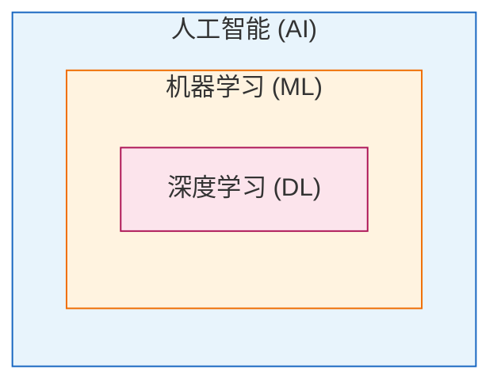

# 模块一：机器学习基石 (Foundations)

*这一模块用于建立大局观，让读者知道机器学习是什么，有哪些分类，以及与深度学习的演进关系。*

## 1. 机器学习概论

### AI ⊃ ML ⊃ DL 关系与学科地图
在日常生活中，我们经常听到人工智能（AI）、机器学习（ML）和深度学习（DL）这三个概念。它们实际上是一个包含关系：
- **人工智能 (AI)**：是一个广泛的概念，旨在研究如何创建一个能够模拟、延伸和拓展人类智能的理论、方法、技术及应用系统。它既可以指研究方法，也可以指具备感知、学习、推理和决策能力的智能载体（如聊天机器人）。
- **机器学习 (ML)**：是实现人工智能的核心路径。它不再依赖人工编写明确的规则，而是让计算机自动从海量数据中寻找规律，并利用这些规律对未来进行预测或决策。**一句话概括**：机器学习不是一堆算法清单，而是「用数据解决问题」的完整工程方法。
- **深度学习 (DL)**：是机器学习的一个子领域，它使用多层神经网络架构，能够自动提取深层次的抽象特征。深度学习在处理非结构化数据（如图像、文本、音频）方面表现卓越，是当前大语言模型和自动驾驶等复杂应用的基础。

下图用嵌套框表示集合包含关系：**AI ⊃ ML ⊃ DL**（外层包含内层）。

### 什么是机器学习？（与传统编程的区别）
传统的编程需要工程师以上帝视角，通过编写清晰明确的规则和步骤来让计算机执行任务（即“硬编码”）。然而，面对复杂世界（如识别一张图片中是否有苹果），穷举所有规则是不可能的。

机器学习则模仿了人类的学习过程：无需显式编程告诉计算机“如何识别”，而是向计算机展示大量带有标签的数据（如大量苹果的图片）。计算机通过海量计算不断试错，自动捕获数据背后的模式和特征。简而言之，**传统编程输入的是规则和数据，输出的是答案；而机器学习输入的是数据和答案，输出的是规则。**

**数据用语基础**：
- **样本 (Sample)**：数据集中的一条记录。
- **特征 (Feature)**：输入变量，即用来做预测的线索。
- **标签 (Label)**：要预测的答案或目标值。
**第一步**：在应用任何算法之前，首先要把业务问题翻译成「特征 → 标签」的监督学习任务。

### 算法 vs 模型的概念辨析
在机器学习中，算法和模型是两个容易混淆的核心概念：
- **算法 (Algorithm)**：是“如何学习”的过程和方法，即指导计算机如何观察数据、找出特征并执行计算的一系列明确的逻辑步骤。
- **模型 (Model)**：是“学习的结果”，是算法在海量数据中寻找出的那套规则集合。它是对复杂现实世界的简化与抽象。**同一算法在不同数据上训练，会得到完全不同的模型**。我们最终消费和用于预测新数据的，正是这个训练好的模型。

### 传统 ML 适用场景与深度学习的演进前提
- **传统 ML vs DL**：
  - **传统机器学习**：擅长处理结构化（表格）数据，高度依赖人工**特征工程**，计算资源消耗较小，结果可解释性强且确定性高。典型应用场景包括金融风控、商品推荐、房价预测等。
  - **深度学习**：擅长处理非结构化数据，通过**多层表征学习**自动提取特征（适用于图像、语音、文本、生成式任务）。
- **深度学习的演进前提**：深度学习虽然强大，但其发展面临着极高的数据与算力门槛。它依赖于两个核心前提：**海量的数据**（互联网时代积累的数字化知识）和**超强的算力**（GPU的快速发展）。只有在这两者具备的情况下，深度学习才能通过庞大的参数空间和矩阵运算，实现智能的突破。

### 机器学习的基本工作流程
机器学习的核心流程可以概括为以下步骤（可与「从业务问题到可用模型」的六步对照记忆：定义问题、准备数据、划分数据、训练优化、评估调参、上线迭代）：
1. **定义目标与指标**：明确是要解决分类问题、回归问题还是聚类问题，并确定业务衡量指标。
2. **清洗与特征**：获取数据并进行探索性分析（EDA）和预处理（这是最耗时的一步）。
3. **训练/验证/测试**：利用算法在训练集上迭代寻找最优参数，在验证集上调参，在测试集上评估最终泛化能力。
4. **欠拟合/过拟合治理**：诊断模型状态并进行针对性调优。
5. **上线监控与周期性重训**：将训练好的模型应用于未知的新数据中进行预测，并持续监控数据漂移，定期重新训练模型。

### 核心数据假设：独立同分布与平稳性
在应用机器学习算法时，我们通常会对数据分布做出潜在假设。理解这些假设对于处理实际业务（尤其是时间序列数据）至关重要。

- **独立同分布 (I.I.D - Independent and Identically Distributed)**：
  传统机器学习通常假设训练集和测试集的样本是独立且服从相同分布的。如果线上数据分布发生变化（即**数据漂移 Data Drift**），模型性能就会下降，这也是为什么在工作流程中需要“持续监控与周期性重训”。

- **平稳性 (Stationarity)**：
  在**时间序列分析**（如股票预测、销量预测）中，数据往往不是独立的（具有时间依赖性）。此时，我们转而关注数据的“平稳性”。
  - **什么是平稳性？** 直观来说，平稳性意味着数据的统计特征（如均值、方差、协方差）不随时间的推移而发生变化。如果一个时间序列围绕着一个常数均值上下波动，且波动幅度基本一致，我们通常认为它是平稳的。
  - **为什么需要平稳性？** 如果数据是非平稳的（例如有明显的上升趋势或周期性变化），模型就很难从过去的历史中总结出适用于未来的稳定规律。

**数据不平稳的处理方法**：
如果遇到不平稳的时间序列数据，通常需要通过以下方法将其转化为平稳（或弱平稳）序列，再喂给模型：

1. **差分 (Differencing)**：计算相邻时间步的观测值之差（如 $y_t - y_{t-1}$），用于消除长期的线性或非线性趋势（Trend）。
   > 如：某城市的年度 GDP 连年稳步增长，直接预测很难。通过一阶差分（今年 GDP - 去年 GDP），得到的是“GDP 增长量”，这个增长量往往是围绕某个常数波动的平稳序列。
2. **对数/幂变换 (Log/Power Transform)**：对数据取对数或开根号，用于平抑随着时间推移而不断变大的方差（即让波动幅度更稳定）。
   > 如：某初创公司的 APP 日活用户呈指数级爆发，早期每天波动几百人，后期每天波动几万人（方差变大）。取对数后，指数增长变为线性增长，波动幅度也被压缩到同一量级。
3. **季节性差分 (Seasonal Differencing)**：计算当前值与上一个周期对应值之差，用于消除强烈的季节性/周期性因素（Seasonality）。
   > 如：冰淇淋的月销量，每年都是夏天高、冬天低。使用季节性差分（今年 7 月销量 - 去年 7 月销量），可以消除这种“夏天必高”的季节性规律，从而只保留业务真实的净增长或衰退趋势。
4. **时间序列分解 (Decomposition)**：将序列拆解为趋势成分、季节成分和残差成分，然后专门对相对平稳的残差部分进行建模。
    > 如：航空公司的月度客流量非常复杂。我们可以先用算法把数据拆解为三条线：一条向上的“长期趋势线”，一条每年循环的“季节周期线”，最后剩下无规律的“残差线”。我们只需对平稳的“残差线”进行建模预测，最后再把趋势和季节性加回去。

#### 四种处理数据不平稳方法的对比速查表

| 维度 | **差分** (Differencing) | **对数/幂变换** (Log/Power Transform) | **季节性差分** (Seasonal Differencing) | **时间序列分解** (Decomposition) |
| :--- | :--- | :--- | :--- | :--- |
| **主要解决的非平稳性** | **均值不平稳**（长期趋势） | **方差不平稳**（异方差性） | **季节/周期不平稳**（固定周期波动） | **混合型不平稳**（趋势 + 季节性） |
| **核心作用** | 消除线性或非线性趋势，提取相邻时间步的增量。 | 稳定方差，将指数级增长转化为线性增长；将乘法模型转化为加法模型。 | 消除固定周期的季节效应，保留业务真实的净趋势。 | 将复杂序列解耦为趋势、季节、残差成分，分别建模。 |
| **典型应用场景** | 具有明显上升或下降趋势的序列（如 GDP、股票价格）。 | 波动幅度随绝对水平成比例放大的序列（如用户爆发式增长、通货膨胀）。 | 具有强周期性波动的序列（如冰淇淋月销量、早晚高峰流量）。 | 包含复杂宏观业务指标（如航空客流、全站大盘 GMV）。 |
| **数学表达** | $y'_t = y_t - y_{t-1}$ | $y'_t = \log(y_t)$ 或 Box-Cox 变换 | $y'_t = y_t - y_{t-m}$（$m$ 为周期长度） | 加法：$y_t = T_t + S_t + R_t$；乘法：$y_t = T_t \times S_t \times R_t$ |
| **副作用或注意事项** | **放大高频噪声**；差分次数过多会丢失长期水平信息（过度差分）。 | **无法直接处理负数或零**（需加常数）；预测还原时存在非线性偏差（$\exp(E[x]) \neq E[\exp(x)]$）。 | 同样会**放大噪声**；需准确预判周期 $m$，若 $m$ 设定错误会引入虚假波动。 | 经典移动平均分解存在**边界效应**（首尾数据缺失）；未来趋势和季节性的外推强依赖于特定假设。 |

---

## 2. 机器学习类型

根据数据集是否带有标签以及学习方式的不同，机器学习主要分为以下几大类：

### 监督学习 (Supervised Learning)
监督学习处理的是**带有标签**的数据。模型通过学习特征（输入）和标签（输出）之间的映射关系来进行预测。根据标签数据类型的不同，又可分为：
- **回归问题 (Regression)**：预测连续的数值。例如预测房价、股票价格等。
- **分类问题 (Classification)**：预测离散的类别。例如判断邮件是否为垃圾邮件（二分类），或识别图片是猫还是狗（多分类）。
*(典型算法脉络：线性回归、逻辑回归、树与集成模型、KNN、朴素贝叶斯、SVM)*

### 无监督学习 (Unsupervised Learning)
无监督学习处理的是**没有标签**的数据。机器需要自行探索数据，发现其内部隐藏的结构、模式或规律。主要包含以下几个方向：
- **聚类 (Clustering)**：计算数据之间的相似度，将行为模式相似的数据自动分组（如用户画像预分群）。
- **降维 (Dimensionality Reduction)**：在尽量不丢失关键信息的前提下，简化数据集，减少特征数量，以提高后续训练的效率并消除共线性。
- **生成式算法 (Generative Models)**：学习真实数据的分布，从而创作出全新的内容（如AIGC、生成逼真的病理切片用于扩充训练集）。
- **异常检测 (Anomaly Detection)**：识别偏离常规模式的数据点（如信用卡欺诈检测），可作为无监督学习的扩展应用场景。

### 强化学习 (Reinforcement Learning)
与使用静态数据集的监督/无监督学习不同，强化学习让**智能体 (Agent)** 在动态**环境 (Environment)** 中不断试错。
- **核心机制**：智能体采取**动作 (Action)**，环境根据动作的好坏给出实时的**奖励 (Reward)** 或惩罚。智能体的目标是探索出一套能够最大化长期累计奖励的最优**策略 (Policy)**。
- **常见应用**：博弈对抗（如 AlphaGo 下围棋）、机器人姿态控制、推荐策略、自动驾驶等。
- **与大模型的结合**：在当前的大语言模型（LLM）训练中，最后一步通常会使用基于人类反馈的强化学习（RLHF），使模型的输出与人类的意图和价值观对齐。

### 半监督学习 (Semi-Supervised Learning)
介于监督学习和无监督学习之间。在实际业务中，获取少量带标签数据成本较低，但大量数据无标签。半监督学习利用少量有标签数据和大量无标签数据共同训练模型，以提高学习准确率。

#### 机器学习主要类型速览表（便于记忆）

| 类型 | 数据侧要点 | 典型任务 / 子方向 | 典型算法 / 模型 | 一句话抓住区别 |
|------|------------|-------------------|-----------------|----------------|
| **监督学习** (Supervised Learning) | **有标签**：已知「特征 → 正确答案」 | 回归（连续数值）、分类（离散类别） | **回归**：线性回归、岭回归 / Lasso、回归树 / 梯度提升树；**分类**：逻辑回归、决策树、随机森林、GBDT / XGBoost / LightGBM、KNN、朴素贝叶斯、SVM、MLP 等神经网络；同类算法换损失函数即可兼容回归或分类 | 有人打分/打标，学的是输入到输出的**直接映射** |
| **无监督学习** (Unsupervised Learning) | **无标签**：只有数据、没有标准答案 | 聚类、降维、生成式建模、异常检测 | **聚类**：K-Means、层次聚类、DBSCAN、GMM；**降维**：PCA、ICA、t-SNE、UMAP；**生成**：GAN、VAE、流模型 / 扩散模型（思想级）；**异常**：Isolation Forest、One-Class SVM、基于自编码器重构误差等 | 从数据里**挖结构 / 分布 / 离群**，不强制对应某个标签 **y** |
| **强化学习** (Reinforcement Learning) | **序列交互 + 奖励**，非一次性静态「打标数据集」为主 | 智能体在环境中选动作，最大化**长期累计回报**；博弈、控制、对齐人类偏好（RLHF）等 | **价值方法**：Q-learning、DQN 及其变体；**策略梯度**：REINFORCE、PPO 等；**Actor-Critic**：A2C / A3C、DDPG、SAC、TD3 等；**对齐**：RLHF（常配合 PPO 等策略优化） | **试错 + 奖惩信号**，目标是**最优策略**，不是拟合一张静态监督表 |
| **半监督学习** (Semi-Supervised Learning) | **少量有标签 + 大量无标签** | 共用两类数据提升效果，缓解标注成本 | **一致性正则**（如 Mean Teacher、VAT、FixMatch）；**伪标签 / 自训练**；**图/流形**：标签传播；与生成或对比表征结合的方法（如部分半监督 GAN / 自监督预训练 + 少量微调等工程组合） | **省标注**：有标给方向，无标扩充数据「形状」 |

---

## 深度学习衔接（选修 Outlook）
机器学习是通向深度学习的必经之路。掌握了机器学习的基础后，可以自然过渡到深度学习的核心概念：
- **神经网络基本意象**：多层感知机 (MLP) 本质上是多个逻辑回归的非线性叠加。基础单元是神经元 $y = f(\sum w_i x_i + b)$，其中 $f$ 是激活函数（如 Sigmoid、ReLU、Tanh）。
- **CNN 用于图像**：卷积神经网络 (CNN) 通过卷积层（提取局部特征）、池化层（降维防过拟合）和全连接层（输出分类）的分工，完美解决了图像处理问题。
- **RNN / Transformer**：循环神经网络 (RNN) 及其演进版本 Transformer 专为序列数据（如文本、时间序列）设计。Transformer 凭借其强大的“注意力机制 (Attention)”，成为了当前大模型时代（如 GPT 系列）的绝对基石。

---

## 🎯 配套实战案例指引
本知识库配套了完整的 Jupyter Notebook 代码实战。在学习完本模块的理论后，请打开对应的 Notebook 进行动手操作。
- **实战目标**：熟悉机器学习的标准工作流程（定义问题 -> 数据清洗 -> 特征工程 -> 模型训练 -> 评估调优）。
- **案例背景**：我们将以经典的**“泰坦尼克号生存预测”**或**“客户流失预测”**为例，带你走过从原始脏数据到可用模型的完整链路。