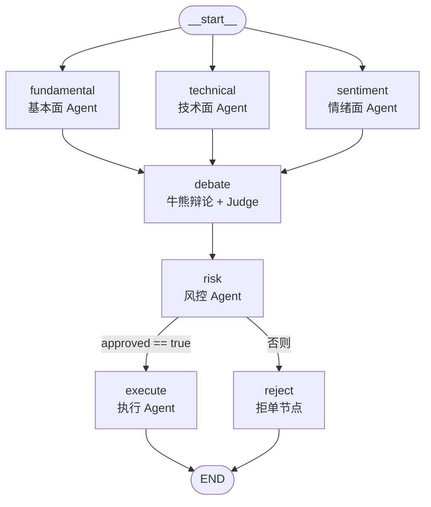

> 对应仓库：**多 Agent 量化交易与投资决策系统**（六角色协作：三维分析 → 牛熊辩论 → 风控门禁 → 模拟执行；Python 以 **LangGraph** 为主干，另含 **Java / Go** 对照实现）。  
> 本文结构与 [ETF 监控项目复盘](/knowledge/06-quant-finance/quant-strategy/project-etf-monitoring-interview) 对齐：**速览 → 技术栈原理 → 模块考点 → 追问 → 演示 → 清单**。

## 一、技术栈速览（面试可先说这张表）

| 层级 | 选型 | 你在项目里具体做了什么 |
|------|------|------------------------|
| 编排（Python） | **LangGraph** `StateGraph` | Fan-out 三路并行分析；**`Annotated[list, operator.add]`** 合并并行结果；**`add_conditional_edges`** 风控通过后执行/拒单 |
| LLM | **LangChain** `ChatOpenAI` | 各 Agent 的 system/human 消息、结构化 JSON 输出 |
| 市场数据 | **yfinance** | 行情、财务、新闻等；经 **全进程串行锁 + 最小间隔 + 429 重试** 封装（`run_yfinance`） |
| 技术指标 | **pandas** + **pandas-ta** | MACD/RSI/布林带/SMA、量能规则；**参数与列名见 §2.2** |
| 情绪 | **TextBlob**（示例） | 新闻标题极性；可替换为更强 NLP |
| 配置与契约 | **pydantic**、**python-dotenv** | 集中配置、环境变量 |
| 执行（可选） | **alpaca-trade-api** | Paper / 实盘通道；默认 **dry_run** |
| 回测 | 自研 + **matplotlib** 等 | 简化回测与报表（注意：教学演示，非生产品质） |
| 多语言对照 | **Java 21**（Spring AI + `StructuredTaskScope`）、**Go**（goroutine + channel） | 同一拓扑下的并发模型对比，面试加分项 |

**一句话叙事（30 秒）：**  
输入标的 → **基本面 / 技术面 / 情绪面** 三路并行产出结构化分析 → **牛熊多轮辩论 + Judge 裁决** 抑制确认偏误 → **风控硬规则 + LLM 软判断** 双闸门（硬规则不可被模型绕过）→ 通过则 **执行 Agent** 限价与数量逻辑，否则 **RISK_REJECTED** 结束。

---

## 二、技术栈原理与项目用法（面试讲解版）

### 2.0 LangGraph 拓扑图（与 `python/graph/trading_graph.py` 一致）

- **Fan-out**：`__start__` 同时进入 `fundamental`、`technical`、`sentiment`（代码里 `set_entry_point("fundamental")` + 自 `__start__` 指向另两路，语义上等价于三路同源并行）。
- **Fan-in**：三路完成后均汇入 `debate`；并行节点对 `analyses` 的写入经 `operator.add` 合并（见 §2.1）。
- **条件边**：`risk` 节点后由 `should_execute` 根据 `risk_assessment.approved` 分流至 `execute` 或 `reject`，最后到 `END`。



> **并发语义**：图上三路从同一起点出发，运行时由 LangGraph 并行调度；**`debate` 会在三路均到达后**再继续（Fan-in）。数据源侧仍可能经 `run_yfinance` 全局锁串行化 HTTP，与拓扑并行并行不矛盾。

### 2.1 LangGraph：Fan-out / Fan-in、Reducer、条件边

**Fan-out（并行起点）**  
从 `__start__` 连到 `fundamental`、`technical`、`sentiment`；LangGraph 对**无依赖同层节点**并行调度（具体线程/协程由运行时实现，面试答「拓扑层并行」即可）。

**Fan-in（结果合并）**  
三路都输出到 `debate`。若各自往 state 里写**同名列表**，默认会被覆盖；本项目用：

```text
analyses: Annotated[list[dict[str, Any]], operator.add]
```

表示并行节点返回 `{"analyses": [item]}` 时，框架按 **`operator.add`（列表拼接）** 合并，得到 **3 条分析**，再进入辩论。这是典型的 **reducer** 模式，面试高频。

**条件边（门禁）**  
`should_execute(state)` 读 `risk_assessment.approved`，映射到 `execute` 或 `reject`，实现 **一票否决** 的流程分叉。

**检查点（扩展题）**  
代码里 `create_app()` 当前为 `graph.compile()`；若追问「如何断点续跑、审计」——答可挂载 **LangGraph Checkpointer**（如 `MemorySaver` / `SqliteSaver`），用 `thread_id` 恢复；与「业务层风控」无关，属于工程可观测与合规增强。

**与 ETF 监控项目的对比（加分）**  
| | ETF 监控系统 | 本 trading 图 |
|--|-------------|----------------|
| 并行 | 采集侧偏同步节流 | 分析侧 LangGraph 并行 + yfinance 全局串行 |
| reducer | 多为 merge DataFrame | `operator.add` 拼 analyses 列表 |
| LLM | 解释 + 反方复核 | 每 Agent 内 + 辩论 + 风控软规则 |

### 2.2 三维分析使用的指标与数据字段（与 `python/agents/*` 一致）

以下便于面试「你用了哪些因子/技术指标」时**按模块背**，括号内为 yfinance / pandas-ta 侧常见来源或参数。

#### Fundamental Agent（`fundamental_agent.py`）

| 字段/概念 | 含义 | 数据来源（yfinance `info` 键） |
|-----------|------|-------------------------------|
| PE | 市盈率（Trailing PE） | `trailingPE` |
| PB | 市净率 | `priceToBook` |
| ROE | 净资产收益率 | `returnOnEquity` |
| Revenue Growth | 营收增速 | `revenueGrowth` |
| Profit Margin | 利润率 | `profitMargins` |
| Debt/Equity | 负债权益比 | `debtToEquity` |
| Free Cash Flow | 自由现金流 | `freeCashflow` |
| （辅助）市值 / 行业 | 上下文字段 | `marketCap`、`sector`、`industry` |

综合 **1～10 分**与 `BUY/SELL/HOLD` 由 **LLM** 按 system prompt 中的区间规则（如 PE&lt;15 加分等）在结构化 JSON 中输出；字段缺省或限流时有 `_data_warning` 偏保守处理。

#### Technical Agent（`technical_agent.py`）

- **K 线窗口**：默认 `period="6mo"`（`stock.history`）。  
- **MACD**：`pandas_ta` 默认 **`MACD_12_26_9`**，含 `MACDs_*`（信号线）、`MACDh_*`（柱）。  
- **RSI**：**14 日** → 列名 `RSI_14`。  
- **布林带**：**周期 5、标准差倍数 2.0** → `BBU_5_2.0` / `BBM_5_2.0` / `BBL_5_2.0`（上轨/中轨/下轨）。  
- **均线**：**SMA(20)**、**SMA(50)**。  
- **成交量状态**：相对 **20 日均价量**——当前量 &gt; 1.5× 均值为 `HIGH`，&lt; 0.5× 为 `LOW`，否则 `NORMAL`。  

同样由 **LLM** 根据上述数值与 prompt 中的金叉/超买超卖/多头空头排列等规则输出 score 与 signal。K 线限流时降级为无指标说明、倾向 HOLD。

#### Sentiment Agent（`sentiment_agent.py`）

| 输入 | 说明 |
|------|------|
| 新闻情绪 | yfinance `stock.news`，**最多取 20 条**标题，**TextBlob** `sentiment.polarity`（约 **-1～+1**）取均值 |
| 新闻条数 | 实际参与计算的条数，供 LLM 判断关注度 |
| 机构持仓 | `institutional_holders` 有表则为 **`ACTIVE`**，否则 **`UNKNOWN`**（简化三态，非精细增减持比例） |
| 分析师评级 | `recommendations` **最后一行**的 **`To Grade`** 字符串 |

#### Risk Agent（`risk_agent.py` + `config.settings.RiskConfig`）

| 类型 | 内容 |
|------|------|
| **硬规则（代码）** | 单票仓位 ≤ `MAX_POSITION_SIZE`（默认 **10%**）；组合回撤 ≤ `MAX_DRAWDOWN_LIMIT`（默认 **8%**）；**VaR(95%)×建议仓位** ≤ `MAX_PORTFOLIO_RISK`（默认 **2%**）；另算止损价等（如 `STOP_LOSS_PCT` **5%**） |
| **VaR** | 约**过去一年**日收益率历史模拟，**5% 分位数**损失取绝对值（见 `_calculate_var`） |
| **软规则** | LLM JSON：`approved`、`adjusted_position_pct`、`soft_warnings`、`reasoning` |

> 执行侧限价滑点等见 `execution_agent` README 描述；回测参数见 `BacktestConfig`（起止日、初始资金等），与「单日信号指标」区分开即可。

---

### 2.3 yfinance 与「假并行」下的节流

**矛盾**：图上路并行三个 Agent，但 **Yahoo/数据源易限流**。  
**实现**：`run_yfinance` 用 **全局 `threading.Lock`**，在锁内保证：

- 两次调用间隔 ≥ `YFINANCE_MIN_INTERVAL_SEC`（默认 2s，可调 env）  
- 遇 **`YFRateLimitError`**：释放锁后 **指数退避**（`2**attempt * base`），最多 `YFINANCE_MAX_RETRIES` 次  

**面试怎么说**：「LangGraph 从拓扑上并行，但 **IO 临界区串行化**，用锁把 burst 压平，避免 429；这是 **协作式背压**，不是取消并行逻辑。」

---

### 2.4 辩论机制：对抗角色、轮次上限、Judge

- **Bull / Bear**：对抗提示词，强制多空论据；每轮可看到对方摘要再反驳。  
- **`MAX_DEBATE_ROUNDS = 2`**：**防止对话式 Agent 死循环**，面试必提。  
- **Judge**：综合双方论点输出 `final_signal`、`target_position_pct` 等结构化字段，**不是简单投票**。  
- **确认偏误**：三分析师同向时，Bear 仍要找风险——产品叙事与金融心理学挂钩。

---

### 2.5 风控：硬规则 vs LLM、VaR

- **硬规则**（代码）：单票仓位上限、组合回撤、**VaR(95%) × 仓位** 与组合风险上限等；**违规直接否决**，不依赖模型。  
- **VaR（历史模拟法简介）**：用历史日收益分布的分位数估计单日最大损失（如 95% 置信度）；实现上用 `numpy.percentile`。  
- **软规则（LLM）**：在硬规则通过前提下，仍可建议降仓或否决（边界场景、叙事风险）。  
- **为何底线不用 LLM**：提示注入、幻觉、不可审计；**合规与熔断必须确定性**。

---

### 2.6 执行 Agent 与回测

- **Dry run**：只写结果状态，不真实报单。  
- **限价与滑点**：对称的 `slippage_tolerance` 调整买卖限价（README 示例思路）。  
- **回测**：README 给出区间、夏普、回撤等表格；答辩时强调 **样本短、无交易成本与冲击模型简化、过拟合风险**，避免把回测当承诺收益。

---

### 2.7 Java / Go 对照（并发模型题）

| 语言 | 并行原语 | 合并结果 |
|------|----------|----------|
| Python | LangGraph 调度 + yfinance 锁 | `operator.add` |
| Java 21 | `StructuredTaskScope` + Virtual Thread | 线程安全集合 / 聚合 |
| Go | goroutine + channel | 固定缓冲 channel 收集 |

**用途**：同一产品故事下展示你了解 **生态差异**，不限于只会 Python。

---

## 三、按模块准备的面试知识

### 3.1 六类 Agent 职责（速记表）

| Agent | 输入侧重 | 输出要点 |
|-------|----------|----------|
| Fundamental | PE/PB/ROE/增长等 | score、signal、reasoning |
| Technical | MACD/RSI/布林带/SMA | 同上 |
| Sentiment | 新闻情绪、机构、评级等 | 同上 |
| Debate | `analyses` 列表 | bull/bear 论据、Judge、仓位建议 |
| Risk | debate + 组合状态 | approved、违规列表、软警告 |
| Execution | 通过后 | 订单字段、dry_run 状态 |

前三类 Agent 的**指标与数据字段**见 **§2.2**。

### 3.2 与站内通用笔记的衔接

- 多 Agent / ReAct / 状态机：[Agent 架构](/knowledge/05-ai-ml/ai-agent/agent-architecture)  
- LangGraph 更细考点：[ETF 项目 § 三 · 4.5](/knowledge/06-quant-finance/quant-strategy/project-etf-monitoring-interview)（条件边、checkpoint 辨析通用）  
- Prompt / JSON：[Prompt 与上下文](/knowledge/05-ai-ml/ai-agent/prompt-engineering)  
- 回测与过拟合：[回测与实盘](/knowledge/06-quant-finance/quant-strategy/backtest-and-live)  

---

## 四、高频追问与参考答案要点

1. **「并行三路和 yfinance 锁不会矛盾吗？」**  
   **不矛盾**：并行减少「等待彼此」的空闲；锁保证 **对数据源串行友好**。延迟主要来自 **LLM 与网络**，不是 Python 多线程抢满 CPU。

2. **`operator.add` 和手写 merge 区别？**  
   框架级 reducer，并行节点返回增量列表时 **自动 concat**；手写需在 fan-in 节点里自己 `extend`，易漏、难维护。

3. **「辩论多轮仍然很武断怎么办？」**  
   承认 LLM 不等于真实投委会；可加 **置信度阈值、人类在环、仅辅助研究下单**。本项目亮点是 **流程设计**（对抗 + 硬风控），非圣杯 alpha。

4. **「风控 LLM 会不会和硬规则冲突？」**  
   硬规则先执行；**未过硬规则无需调 LLM**（实现上节省调用且逻辑清晰）。软层在硬层之上微调叙事风险。

5. **「和单 Agent RAG 选股比优势？」**  
   **角色分工 + 可测试边界**（每步输入输出清晰）；**硬门槛**可单测；辩论 **显式记录多空论据**，利于审计与复盘。

6. **「能否线上生产？」**  
   需：**合规数据源、交易风控、监控、回测与实盘偏差、密钥与审计、检查点** 等；本项目定位 **学习/面试/原型**。

---

## 五、口头演示路径（10～20 分钟）

1. 白板画 **拓扑**：start → 3 并行 → debate → risk → execute/reject。  
2. 指着 **reducer** 解释为何会拼出 3 条 `analyses`。  
3. 讲 **两轮辩论 + MAX_DEBATE_ROUNDS**。  
4. 画 **硬规则盒子** 在 LLM 软规则之前。  
5. 提 **`run_yfinance`**：并行图下的串行数据源门控。  
6. 若时间有剩：一句 **Java/Go** 并行模型对比。

---

## 六、自荐复习清单（考前勾选）

- [ ] 能画 LangGraph：**Fan-out / Fan-in / conditional_edges / END**  
- [ ] 能解释 **`Annotated[list, operator.add]`** 与并行写入  
- [ ] 辩论：对抗角色、轮次上限、Judge 输出字段  
- [ ] 风控：硬规则清单、VaR 直觉、为何底线不用纯 LLM  
- [ ] yfinance：`Lock`、最小间隔、`YFRateLimitError`、指数退避 env  
- [ ] **指标（§2.2）**：技术面 MACD/RSI/BB/SMA/量能；基本面 PE/PB/ROE 等 yfinance 键；情绪 TextBlob、新闻条数、机构/评级  
- [ ] 回测局限：样本外、成本、过拟合（能答「不构成投资建议」）  
- [ ] （加分）Java `StructuredTaskScope` vs Go channel 一句对比  

---

## 七、与仓库内文档的关系

原项目 `docs/` 下已有 **interview-guide、architecture、agent-design-patterns、resume-template** 等详尽材料。  
**本页**聚焦于：把你的仓库内容 **压缩成与面经知识库统一的复习结构**，并与 ETF 监控篇、通用 AI Agent 章节 **互链**。

---

## 八、模拟面试：面试官提问与参考答案（实习生向）

> 设定：技术面或项目深挖，对象是**实习/校招**候选人。下面是面试官可能怎么问，以及你可以怎么答（**不求炫技，讲清逻辑即可**）。

**Q1（开场）先介绍一下你这个多 Agent 项目是做什么的？**  
**答：** 输入一个标的，系统模拟「小投研团队」：基本面、技术面、情绪面三个分析 Agent 并行出结论，再交给牛熊辩论和 Judge 综合决策，然后风控审查，通过了才走执行节点模拟下单，被拒就记成风控否决。定位是学习和展示多 Agent 编排，不是实盘荐股。

**Q2 为什么用 LangGraph，不用「一个大 Prompt 让模型全包」？**  
**答：** 流程链长、角色多，用图把**步骤边界**固定下来，每步输入输出清晰，方便调试和加硬规则门禁；单 Prompt 容易混在一起，风控也不好插确定性代码。

**Q3 你说的 Fan-out、Fan-in 在本项目里具体指什么？**  
**答：** Fan-out 是从起点同时拉起基本面、技术面、情绪面三个节点；Fan-in 是三路都结束后汇入辩论节点。分析结果存在 state 的 `analyses` 列表里，交给 Debate。

**Q4 `Annotated[list, operator.add]` 是干什么的？不用会怎样？**  
**答：** 这是 LangGraph 的 reducer：几个并行节点各往 `analyses` 里追加一小段列表时，框架自动用 `operator.add` **拼接**，不会互相覆盖。如果不用，并行写同一个 key 可能发生后写覆盖先写，丢两路结果。

**Q5 图上是并行，为什么你们还要对 yfinance 做全局锁？**  
**答：** 拓扑并行不等于要对数据源狂并发。Yahoo 这边容易 429，我们用 `run_yfinance` **串行化网络请求**并加最小间隔和限流重试，否则三路一起打很容易被封。这是**协作式限流**，和 LangGraph 的并行调度不矛盾。

**Q6 辩论 Agent 解决了什么问题？为什么设 `MAX_DEBATE_ROUNDS = 2`？**  
**答：** 解决**确认偏误**：三路人马都偏多时，仍强制 Bear 找风险。轮次上限是防止 LLM 对话无限拉扯、成本和延迟失控，和「固定深度的工作流」一致。

**Q7 风控里「硬规则」和「软规则」怎么分工？硬规则没过还会问 LLM 吗？**  
**答：** 硬规则是代码里算仓位、回撤、VaR 敞口等，过了才进入 LLM 软判断；**硬规则一违规就直接否决**，不调软规则，避免浪费调用也给审计一条清晰底线。

**Q8 你们 VaR 大概怎么算的？**  
**答：** 历史模拟：取过去一段日收益率，算分位数得到单日损失的一个估计，再和建议仓位结合看组合风险是否超上限。参数和区间都是配置里的教学设定。

**Q9 从风控到执行，图上怎么分叉？**  
**答：** `add_conditional_edges` 根据 `risk_assessment` 里的 `approved` 走 `execute` 或 `reject` 节点，最后都到 END。

**Q10 执行 Agent 的 dry run 是什么意思？**  
**答：** 只把决策结果写到 state/日志，不真实向券商发单；若要接 Alpaca 等还要单独配置，我们默认以安全模拟为主。

**Q11 回测结果不错，能说明策略一定赚钱吗？**  
**答：** 不能。区间短、成本高估/低估、无冲击模型、过拟合和幸存者偏差都可能有；**回测用于验证流程和指标口径**，不是用来承诺收益，实盘要另做风控与合规。

**Q12 风控 LLM 返回的不是合法 JSON 怎么办？**  
**答：** 代码里解析失败会走**保守策略**——类似否决或给出安全默认，避免「解析挂了还当通过」。

**Q13 如果加一个「人类交易员最终点确认」节点，你会插在哪？**  
**答：** 常见插在**风控之后、执行之前**：机器跑完硬软风控，人再点同意才调用执行；或仅在超过某额度时触发 human-in-the-loop。

**Q14 除了 Python 版，你还了解 Java/Go 版在表达什么？**  
**答：** 同一套业务拓扑，用 Java 结构化并发或 Go 的 goroutine+channel 实现 fan-out/fan-in，说明我不只依赖一个语言，理解**并发模型差异**。

**Q15（收尾）你觉得自己在这个项目里最大的收获是什么？**  
**答：** 把**多 Agent 产品流程**落成可运行图：** reducer、条件边、硬门禁**，以及数据层限流，都是以后做对话式或交易类系统能复用的套路。

**Q16 三个分析 Agent 分别用了哪些具体指标或数据？**  
**答：** 基本面主要是 yfinance `info` 里的 PE、PB、ROE、营收增速、利润率、负债权益比、自由现金流等；技术面用 pandas-ta 算 **MACD(12,26,9)**、**RSI(14)**、**布林带(5,2)**、**SMA20/SMA50**，再加相对 20 日均量的量能档位；情绪面是 **TextBlob** 打新闻标题（最多 20 条）、机构持仓表有没有数据、分析师推荐表的最新档位，交给 LLM 综合打分。细节可按 **§2.2** 展开。

---

*维护说明：若 `trading_graph.py`、各 Agent 指标或 `RiskConfig` 变更，请同步更新 **§2.2**、第二节风控与第四节相关表述。*
